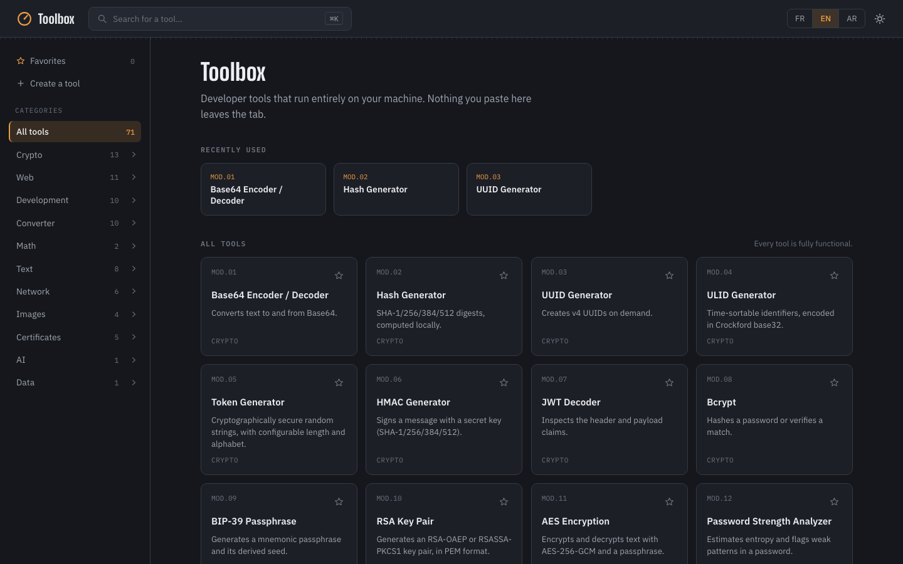

# Toolbox

A design-first clone of IT-Tools: developer utilities that run entirely client-side.



## Structure

```
apps/web           Vite + React + TypeScript SPA
packages/ui         Design system: tokens, components, icons
packages/core        Shared hooks (theme, command palette)
packages/tools       Tool registry + individual tool implementations
```

Each tool is a self-contained module registered in `packages/tools/src/registry.ts`
as `{ id, name, category, description, status, Component }`. Adding a tool means
writing its component and adding one entry to that array — the home grid, the
category rail, the command palette, and routing all pick it up automatically.

`status: "ready"` tools render their component on `/tools/:id`. `status: "planned"`
tools still appear in the grid (to validate the UI at full scale) but open to an
empty state instead of a component.

## Languages

The app shell and tool catalog ship in French, English and Arabic (with RTL
layout), with one file per language under `packages/core/src/i18n/` — see
`AGENTS.md` for how it's wired and how to add another language. Each
individual tool's own internal UI is still French-only for now; that's a
separate, incremental migration.

## Custom tools

Anyone using the app can add their own tool from **Créer un outil** in the sidebar,
without touching code or rebuilding. A custom tool is a small JavaScript function
(`input => output`) plus a name, description and category — either an existing one
or a brand new one, which then gets its own pinned section in the sidebar, right
under Favoris. Custom tools are stored in `localStorage`
(`workbench:custom-tools`, see `packages/core/src/useCustomTools.ts`) and merged
with the built-in registry everywhere: the home grid, the sidebar, the command
palette, and favorites.

This is local, single-user customization, not a plugin marketplace: the code runs
unsandboxed, with the same permissions as the page — appropriate for scripts you
wrote yourself, not for installing something from someone else. The UI says as
much. A sandboxed, shareable plugin format is a bigger, separate project.

## Develop

```bash
npm install
npm run dev
```

Opens at `http://localhost:5173`.

## Build

```bash
npm run build
```
